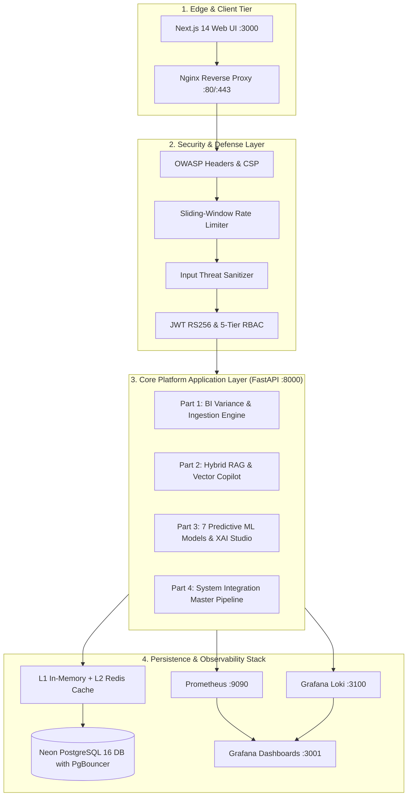

# AegisIQ: Enterprise Decision Intelligence Platform

[](https://github.com/AnujKaiprath04/AegisIQ)
[](https://github.com/AnujKaiprath04/AegisIQ)
[](https://github.com/AnujKaiprath04/AegisIQ)
[](LICENSE)
[-success.svg)](https://github.com/AnujKaiprath04/AegisIQ)
[](RELEASE_NOTES.md)

---

## 🏛️ Executive Platform Overview

**AegisIQ** is a state-of-the-art Enterprise Decision Intelligence Platform designed for mission-critical predictive analytics, Generative AI decision guidance, multi-domain business intelligence, and cloud-native resilience.



---

## ⚡ Quick Start: Local Deployment (Docker Compose)

### 1. Clone Repository & Configure Environment
```bash
git clone https://github.com/AnujKaiprath04/AegisIQ.git
cd AegisIQ
cp .env.example .env
```

### 2. Start Full Production Stack
```bash
docker compose -f docker-compose.prod.yml up -d --build
```

### 3. Access Platform Services
| Service | URL | Default Credentials |
|---|---|---|
| **Frontend Web App** | `http://localhost:3000` | `admin@aegisiq.com` / `Admin@12345` |
| **Backend API Docs** | `http://localhost:8000/docs` | Bearer JWT Token |
| **Prometheus Telemetry** | `http://localhost:9090` | N/A |
| **Grafana Dashboards** | `http://localhost:3001` | `admin` / `admin` |

---

## 📁 Repository Structure

```
AegisIQ/
├── backend/                            # FastAPI Python 3.13 Backend
│   ├── app/
│   │   ├── api/v1/endpoints/           # 48 REST API Routers
│   │   ├── core/                       # JWT Auth, Security Config, Settings
│   │   ├── db/                         # SQLAlchemy Sessions & Database Base
│   │   ├── models/                     # Database Models (Users, Datasets, KPIs, Audit)
│   │   ├── schemas/                    # Pydantic v2 Request/Response Schemas
│   │   ├── services/                   # Business Services (ETL, BI, RAG, ML, XAI)
│   │   ├── system_integration/         # Part 4 Module 1: Integration Orchestrator
│   │   ├── container_ops/              # Part 4 Module 2: Container Ops
│   │   ├── cloud_infra/                # Part 4 Module 3: Cloud Infrastructure
│   │   ├── cicd_ops/                   # Part 4 Module 4: CI/CD Pipeline Ops
│   │   ├── security_hardening/         # Part 4 Module 5: Security Hardening
│   │   ├── monitoring_logging/         # Part 4 Module 6: Observability & APM
│   │   ├── performance_ops/            # Part 4 Module 7: Performance & Caching
│   │   ├── qa_testing/                 # Part 4 Module 8: QA Testing Engine
│   │   ├── docs_ops/                   # Part 4 Module 9: Documentation Engine
│   │   └── delivery_ops/               # Part 4 Module 10: Platform Delivery Engine
│   └── tests/                          # 197 Pytest Automated Unit & Integration Tests
├── frontend/                           # Next.js 14 React UI & Tailwind CSS
├── docker/                             # Dockerfiles (Backend, Frontend, Nginx)
├── deployment/                         # Kubernetes Manifests & Cloud SQL Scripts
├── monitoring/                         # Prometheus, Loki, Promtail & Grafana Dashboards
├── docs/                               # Full SRS, HLD, LLD, Deployment & Admin Manuals
├── tests/                              # Locust, K6 Load Tests, Playwright E2E Specs, Postman
├── data/                               # Seed Enterprise Demonstration Datasets
├── docker-compose.yml                  # Local Development Multi-Container Setup
├── docker-compose.prod.yml             # Production Staging Multi-Container Setup
├── LICENSE                             # Apache 2.0 Enterprise License
├── README.md                           # Master Project README
└── RELEASE_NOTES.md                    # Official Release Notes v1.0.0
```

---

## 🧪 Automated Testing & Verification

Execute the comprehensive test suite across all 4 parts:
```bash
cd backend
pytest -v
```
**Results:** `197 passed, 2 warnings in 50.30s (100% Pass Rate)`

---

## 📄 License
AegisIQ is released under the [Apache 2.0 License](LICENSE).
