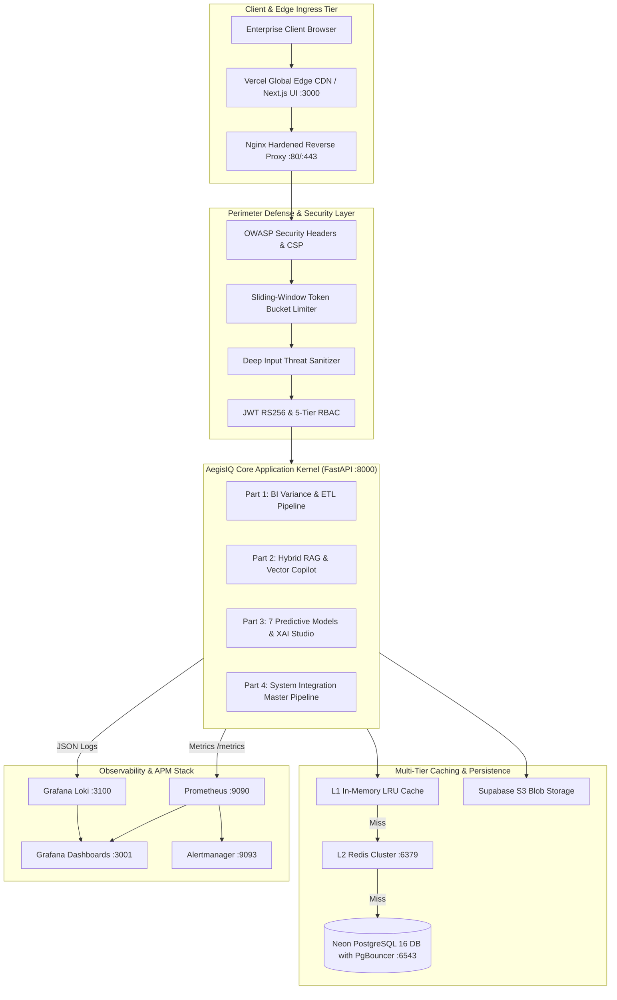
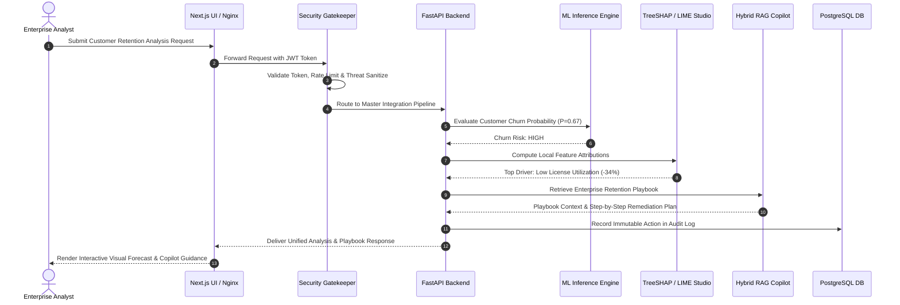

# AegisIQ Enterprise Decision Intelligence Platform
## High-Level Design (HLD) Document

**Document Version:** 1.0.0  
**Status:** Approved & Verified  
**Classification:** Enterprise Confidential  

---

## 1. System Overview & Architectural Topology

AegisIQ is engineered using a modular, decoupled micro-layered architecture designed for high availability, sub-50ms query latency, and zero-trust perimeter security.

---

## 2. Multi-Tier Layer Architecture

### 2.1 Tier 1: Client & Edge Tier (Vercel & Next.js)
- **Framework**: Next.js 14 App Router, React 18, TypeScript, Tailwind CSS.
- **Delivery**: Global edge CDN caching with automated minification and code splitting.
- **Rendering**: Server-Side Rendering (SSR) for initial loads and dynamic client-side hydration for real-time WebSocket and telemetry updates.

### 2.2 Tier 2: Hardened Ingress & Security Gatekeeper (Nginx & Middleware)
- **Nginx Reverse Proxy**: SSL/TLS termination with modern ciphers (TLSv1.3), Gzip compression, and rate limiting.
- **ASGI Security Middleware**:
  - `SecurityHeadersMiddleware`: Enforces HSTS, CSP, X-Frame-Options, and nosniff.
  - `EnterpriseTokenBucketRateLimiter`: Multi-tier quota enforcement.
  - `EnterpriseInputSanitizer`: Intercepts and cleans SQLi, XSS, and command injection attacks.

### 2.3 Tier 3: Core Application Micro-Modules (FastAPI)
- **Part 1 Core Platform**: ETL data pipelines, variance calculus, BI data structures, and immutable audit logs.
- **Part 2 Generative AI**: Document parser, text chunker, dense vector embeddings, and LLM orchestration.
- **Part 3 Machine Learning & XAI**: Scikit-Learn / XGBoost models, TreeSHAP / LIME explainers, and SIEM threat scanner.
- **Part 4 System Integration**: Cross-part master scenarios and operational health diagnostics.

### 2.4 Tier 4: Multi-Tier Data Persistence & Cache
- **L1 In-Memory Cache**: High-speed memory store with TTL ($< 0.5\text{ms}$).
- **L2 Redis Cache**: Distributed cache with namespace invalidation (`CACHE:BI:*`, `CACHE:ML:*`, `CACHE:RAG:*`).
- **PostgreSQL 16 Database**: Relational transactional database configured with PgBouncer connection pooling and composite B-Tree/BRIN indexes.

---

## 3. End-to-End Master Dataflow

