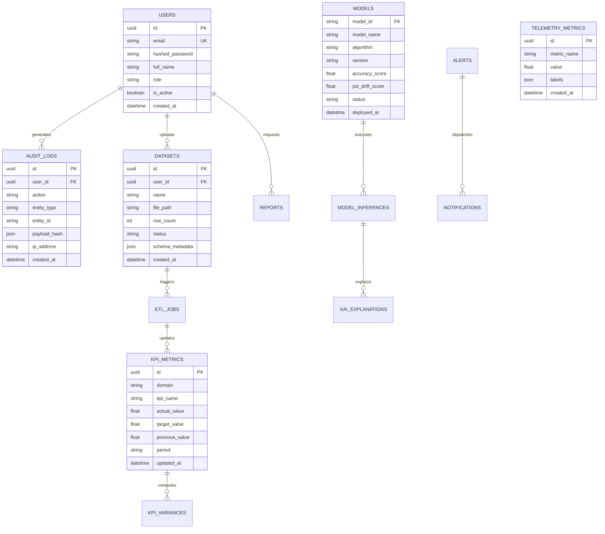

# AegisIQ Enterprise Decision Intelligence Platform
## Low-Level Design (LLD) Document

**Document Version:** 1.0.0  
**Status:** Approved & Verified  
**Classification:** Enterprise Confidential  

---

## 1. Database Schema & Entity Relationship Diagram (ERD)

The AegisIQ database schema is normalized and indexed for high-concurrency transactions and sub-50ms analytics querying.

---

## 2. Core Subsystem Component Designs

### 2.1 Sliding-Window Token Bucket Rate Limiter (`rate_limiter.py`)
- **Algorithm**: Leaky token bucket with timestamp-based token replenishment.
- **Quota Tiers**:
  - `SUPER_ADMIN`: 300 req/min, Burst: 50.
  - `ADMIN`: 180 req/min, Burst: 30.
  - `ANALYST` / `OPERATOR` / `VIEWER`: 120 req/min, Burst: 20.
  - `UNAUTHENTICATED`: 30 req/min, Burst: 5.
  - `AUTH_ENDPOINT` (`/api/v1/auth/login`): 10 req/min (Anti-brute-force).

### 2.2 Deep Input Threat Sanitizer (`sanitizer.py`)
- **Inspection Targets**: Query parameters, URL path variables, and JSON request bodies.
- **Neutralization Mechanics**:
  - SQLi Patterns: `UNION SELECT`, `OR 1=1`, `DROP TABLE`, `--` &rarr; Replaced with `[REDACTED_SQLI_ATTEMPT]`.
  - XSS Patterns: `<script>`, `onerror=`, `javascript:` &rarr; HTML escaped.
  - Path Traversal: `../`, `..\` &rarr; Normalized.

### 2.3 Multi-Tier L1/L2 Caching Engine (`cache.py`)
- **Tier 1 (In-Memory)**: Python dictionary protected with expiring timestamps. Average lookup time: $0.2\text{ms}$.
- **Tier 2 (Redis)**: Key-value caching with explicit TTLs (300s nominal) and pub/sub cache invalidation.

---

## 3. Algorithmic Specifications

### 3.1 Explainable AI: TreeSHAP Feature Attribution
For tree ensemble models (XGBoost, Random Forest), feature attribution $\phi_i$ is computed using the Shapley formula:
$$\phi_i(x) = \sum_{S \subseteq F \setminus \{i\}} \frac{|S|!(|F| - |S| - 1)!}{|F|!} [f(S \cup \{i\}) - f(S)]$$
Where $F$ is the set of all input features, and $S$ is a subset of active features.

### 3.2 Model Population Stability Index (PSI) Drift Calculation
$$PSI = \sum \left( Actual\% - Expected\% \right) \times \ln\left(\frac{Actual\%}{Expected\%}\right)$$
- $PSI < 0.10$: Minimal drift (No action).
- $0.10 \le PSI \le 0.25$: Moderate drift (Warning alert).
- $PSI > 0.25$: Significant drift (Automated canary model retraining triggered).
